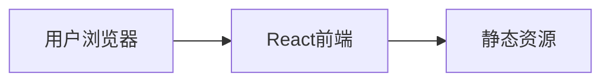

## 1. Architecture Design


## 2. Technology Description
- Frontend: React@18 + tailwindcss@3 + vite
- Initialization Tool: vite-init
- Backend: None (纯静态网站)
- Database: None

## 3. Route Definitions
| Route | Purpose |
|-------|---------|
| / | 首页，展示公司业务和服务 |

## 4. API Definitions
- 不适用（纯静态网站）

## 5. Server Architecture Diagram
- 不适用

## 6. Data Model
- 不适用

## 7. Project Structure
```
src/
├── components/
│   ├── Header.tsx        # 顶部导航组件
│   ├── Hero.tsx          # Hero轮播区组件
│   ├── ServiceSection.tsx # 服务展示区组件
│   ├── ContactFloat.tsx  # 联系浮窗组件
│   └── Footer.tsx        # 底部信息组件
├── App.tsx               # 主应用组件
├── main.tsx              # 入口文件
└── index.css             # 全局样式
```
